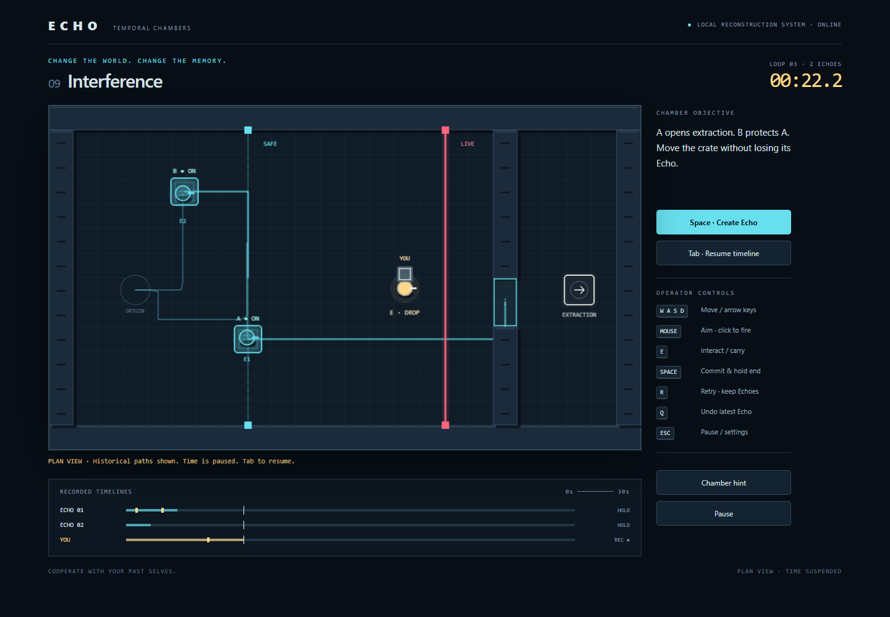

# ECHO — Temporal Chambers

A playable browser puzzle game about cooperating with your past selves. Record a route, reset the chamber, and coordinate with the Echo that repeats it. Eleven chambers progress from your first pressure plate to a three-Echo energy-core extraction.



## Run

Requires Node.js 20.13+ and npm.

```sh
npm install
npm run dev
```

Open the local URL printed by Vite (normally `http://127.0.0.1:5173`). Desktop keyboard and mouse are the primary controls. The game has no external asset or service dependencies.

Gameplay fits the browser viewport without page scrolling. The chamber keeps its aspect ratio, controls compact on smaller windows, and the timeline moves beside the chamber in short landscape windows. All twelve Echo tracks remain visible. Long menus can scroll inside their paused dialog.

```sh
npm test             # simulation regressions and all eleven campaign solutions
npm run typecheck
npm run lint
npm run build        # production files in dist/
npm run preview      # serve the production build locally
npm run test:e2e     # isolated headless Google Chrome playtests
npm run test:production # build and smoke-test dist in isolated Chrome
```

The browser suite uses an installed Google Chrome via Playwright; it does not attach to your normal browser profile. Screenshots go to `.playtest/`, and failure traces to `test-results/`. To use Playwright's bundled Chromium instead, remove `channel: 'chrome'` from `playwright.config.ts` and run `npx playwright install chromium`.

## Controls

| Key                | Action                                                           |
| ------------------ | ---------------------------------------------------------------- |
| WASD / arrows      | Move; diagonal speed is normalized                               |
| Mouse / left click | Aim / fire                                                       |
| E                  | Activate a switch, pick up, or drop an object                    |
| Space              | Commit this attempt as an Echo and reset                         |
| R                  | Discard the current attempt and retry; preserve Echoes           |
| Q                  | Remove the latest Echo and reset                                 |
| Tab                | Pause and inspect historical paths and circuit connections       |
| Escape             | Pause menu, settings, controls, restart chamber, level selection |

An early commit means **repeat the recorded route, then hold the final position**. The Echo remains physical and vulnerable while holding. Letting the timer expire also commits the attempt. A player death freezes the failed attempt with its cause visible; press R to retry without recording the death. Optional chamber hints are available in the sidebar and pause menu.

## What's playable

- Eleven progressive chambers, including timed switches, remote shooting targets, cargo, lasers, shielded sentries, synchronization plates, and a multi-Echo finale. Interference teaches how moving a crate can change an Echo's fate.
- Up to twelve Echoes, undo, full restart, planning paths, event markers, stable/desynced/conflicted/lost status, and contextual interaction prompts.
- Local progression and best scores, master volume, ambient sound, reduced motion, Echo trails, and higher contrast.
- Procedural visuals and Web Audio effects. Sound is optional; mechanics also communicate through shapes, labels, and state changes.

## How timelines work

`src/core/world.ts` is a renderer-independent, fixed 60 Hz simulation. Each recording stores movement/aim intent per simulation tick, discrete actions with stable target IDs, positional checkpoints at 10 Hz, duration, loop number, and end status. Echoes consume actions once in recorded order and move through current collision geometry. They never teleport to correct replay drift.

World changes have consequences: a closed door can block an Echo; a stolen object makes its pickup fail; a dead Echo cancels its remaining actions and releases its cargo. Desync compares the actual route with historical checkpoints using a tolerance and hysteresis. Crates can hold plates, block projectiles when placed, and shield actors downstream of a laser.

Every reset constructs a fresh `World` from the level definition. Only committed runs survive. Projectiles, health, signals, object ownership, cooldowns, hazard phase, action cursors, and elapsed ticks are reconstructed together. Closing doors wait for their footprint to clear. Actors overlap one another to avoid accidental body-blocking of recordings.

`FixedClock` converts render time into simulation ticks. Pausing clears fractional accumulated time. A long frame advances at most six ticks, slowing wall-clock progress rather than skipping gameplay events. Tests compare recordings across 30/60/144 Hz rendering.

## Structure and level authoring

- `src/core/`: typed simulation, collision geometry, session/reset lifecycle, fixed clock.
- `src/levels/campaign.ts`: level definitions and validation.
- `src/render.ts`: Phaser procedural rendering and bounded effects.
- `src/main.ts`: input, scene update, menus, HUD, and progression.
- `src/audio.ts`, `src/persistence.ts`: local audio and validated saves.
- `tests/`: replay, reset, hazard, timing, persistence, and real-input campaign solution tests.
- `e2e/`: actual browser controls, menus, rendering, and campaign integration.

To add a chamber, use `Level` in `src/core/types.ts` and the `point`/`wall` helpers. The chamber is 960 × 560 logical pixels on a 40-pixel grid. Plates and switches publish named signals; doors, lasers, shields, and extraction reference those IDs. Door signal arrays use AND logic. Timed switches retrigger their timer; switches without a duration latch on until reset. Lasers emit downward or rightward and can optionally pulse. Paired teleporters are supported and tested, though the main campaign focuses on the core mechanics.

Add a real-input solution to `tests/campaign.test.ts` and run it before considering a level ready. Those solutions use movement and actions, never teleport actors or force a door open. Check the room in the browser as well: `?debug` unlocks chamber selection and exposes development instrumentation. Instrumentation is omitted from production builds.

Progress uses `echo-save-v1` in local storage. Corrupted or unavailable storage falls back safely. Active mid-chamber timelines are intentionally not saved across reloads. Resetting saved progress requires confirmation in Settings.

The original design brief remains in [ECHO_SPEC.md](ECHO_SPEC.md). See [DEVELOPMENT.md](DEVELOPMENT.md) for current scope and next improvements.
